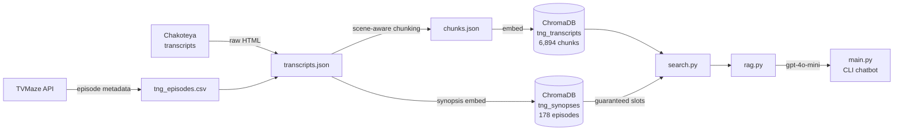

# Star Trek TNG Encyclopedia (RAG)

A retrieval-augmented generation system that answers natural language questions about *Star Trek: The Next Generation* using actual episode transcripts. The chatbot is the demo. The retrieval pipeline and evaluation set are the project.

## Why I Built This

RAG is easy to demo and hard to do well. I wanted to build one end-to-end on a domain I know well enough to write a real evaluation set — not a toy example with cherry-picked queries, but a 25-question golden set where I could measure what was actually failing and why. Most RAG demos ship with no evaluation at all; I treated the golden set as a first-class deliverable and let it drive every retrieval decision.

## Architecture



Two ChromaDB collections serve different retrieval needs: `tng_transcripts` (6,894 scene-level chunks) handles dialogue-level queries; `tng_synopses` (178 episode synopses) handles concept-level queries where the right episode's transcript vocabulary doesn't overlap the query. Each question goes to both; synopsis matches get guaranteed slots in the result set regardless of chunk distance.

## Tech Stack

- **Python 3.12, uv** — dependency management; all scripts are standalone entry points
- **OpenAI text-embedding-3-small** — 1536-dim embeddings; same tokenizer (cl100k_base) used for chunking to keep token counts accurate
- **OpenAI gpt-4o-mini** — generation and faithfulness evaluation
- **ChromaDB** (local persistent) — chose this over Pinecone/Weaviate because there's no operational overhead and the dataset fits comfortably in memory
- **tiktoken** — token-exact chunking; whitespace approximation fallback if unavailable
- **httpx + BeautifulSoup** — transcript scraping with resume support and polite delays

## Key Engineering Decisions

- **Scene-aware chunking → preserves dialogue coherence, increases chunk count from ~3K to ~6.9K** — sliding window within scene boundaries keeps bridge dialogue together. The tradeoff: more chunks, higher embedding cost, but retrieval results are self-contained.
- **Two-stage retrieval with guaranteed synopsis slots → fixes concept-level misses at the cost of rank-1 precision** — The Inner Light and Darmok scored worse on chunk cosine distance (0.40) than unrelated episodes (0.34) because their transcript vocabulary doesn't match query vocabulary. Synopsis retrieval identifies the right episode; guaranteed inclusion bypasses the distance filter. Recall@10 went from 92% to 100%; Recall@1 dropped from 72% to 60%.
- **Token-budget history trimming → predictable context usage, slightly more complex than message-count trimming** — drops oldest user/assistant pairs when history exceeds 3,000 tokens (measured with tiktoken). Bare questions stored in history, not the full context-augmented user message, keeping each exchange ~30 tokens instead of ~2,500.
- **System prompt outside rolling history → never duplicated regardless of trim behavior** — always prepended fresh each call.
- **LLM-as-judge faithfulness eval → no labeled answers needed** — a second gpt-4o-mini call compares the answer against retrieved chunks and returns structured JSON. Baseline: 76% faithful. The 24% failures split into retrieval misses cascading to hallucination (the model invents an answer when context is wrong) and correct answers using conceptual framing not literally in the transcript.

## Example Output

```
You: Which episode has Picard tortured by a Cardassian?

TNG Bot: In "Chain of Command" (Season 6, Episodes 10–11), Picard is captured
and interrogated by Gul Madred, who attempts to break him psychologically by
demanding he admit there are five lights when there are only four...

Sources:
  S06E11 - Chain of Command, Part 2 [Interrogation room]
```

Retrieval eval on 25-question golden set:
```
Recall@1      15/25  (60.0%)
Recall@5      24/25  (96.0%)
Recall@10     25/25  (100.0%)
MRR           0.748
Faithfulness  19/25  (76.0%)
```

## Lessons Learned

- **Title normalization across heterogeneous data sources is a real problem.** Chakoteya and TVMaze had 22 distinct formatting mismatches — embedded `\r\n`, British spelling, roman vs arabic part numbers, inconsistent part suffixes. A regex isn't enough; you need normalization *and* a small alias table for the structurally irreconcilable cases.
- **Dense retrieval has a vocabulary mismatch failure mode that evaluation surfaces clearly.** Without a golden set, both misses would have looked like acceptable behavior. With one, they showed up immediately and pointed directly at the fix.
- **Embed-on-resume has a subtle correctness bug.** After re-chunking, old chunk IDs persist in ChromaDB and the resume logic skips them, leaving stale data silently in the collection. Fix: delete the collection before re-embedding when chunk IDs have changed.
- **The faithfulness evaluator flags correct answers as unfaithful when the model summarizes rather than quotes.** This is a known limitation of LLM-as-judge without reference answers — worth noting before treating 76% as a hard number.

If I were starting over, I'd build the evaluation set before touching retrieval, not after.

## Future Improvements

- **Hybrid search (BM25 + semantic)** — would fix the remaining vocabulary mismatch cases without the guaranteed-slot workaround
- **Cross-encoder reranker** — would recover rank-1 precision lost by guaranteed synopsis slots
- **Expand to DS9, Voyager, Enterprise** — the pipeline is series-agnostic; Chakoteya has all of them
- **Improve faithfulness score** — the 4 non-hallucination failures need better prompt design or chunk overlap tuning so the model stays closer to the source text
- **Web interface** — the CLI works but limits shareability

## Quick Start

```bash
git clone https://github.com/chipbeatty/Trek-Encyclopedia
cd Trek-Encyclopedia
echo "OPENAI_API_KEY=sk-..." > .env
uv sync
uv run python main.py   # ChromaDB index already built; this runs the chatbot
```

To rebuild the index from scratch (~$0.06 in API calls):

```bash
uv run python scrape_transcripts.py
uv run python fix_scenes.py
uv run python chunk.py
uv run python embed.py --synopses
```
